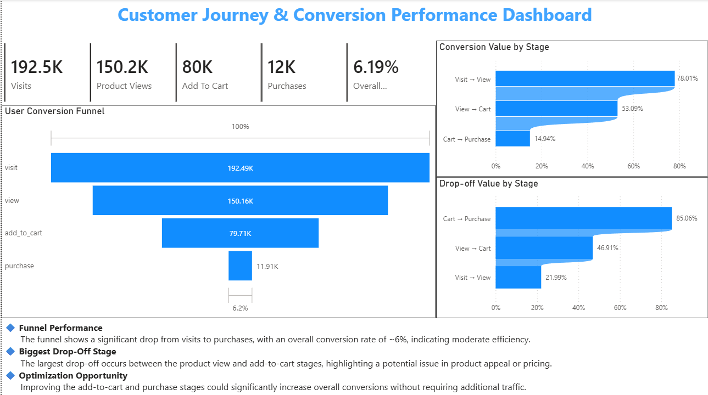
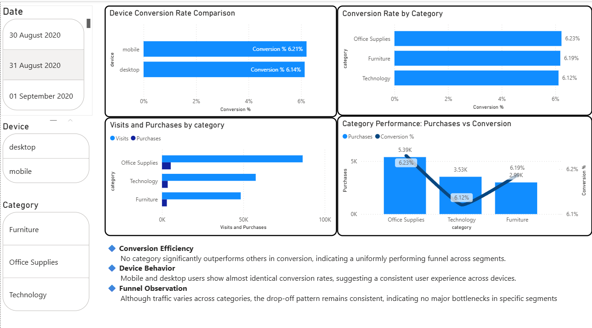
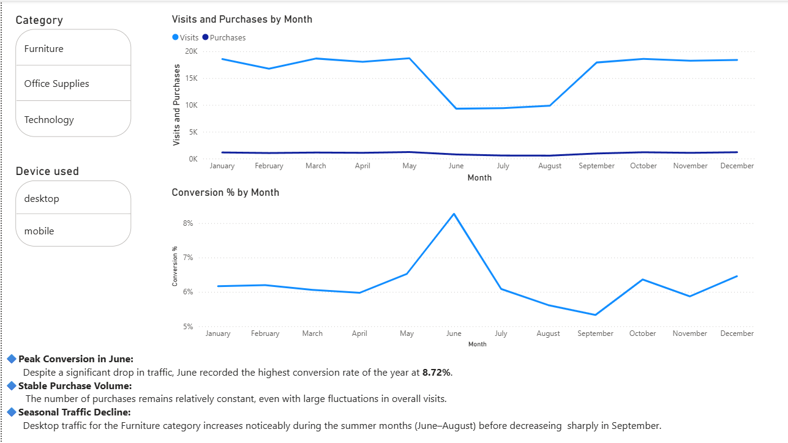

# 📊 E-commerce Conversion Funnel Analysis (Power BI)

## 🔍 Overview
This project presents an end-to-end **E-commerce Conversion Funnel Analysis** built using Power BI.  
It analyzes user behavior across different funnel stages to identify drop-off points, measure conversion rates, and evaluate performance across categories, devices, and time.

---

## 🎯 Objectives
- Track user journey from **Visit → Purchase**
- Calculate **conversion and drop-off rates**
- Identify **bottlenecks in the funnel**
- Compare performance across **categories and devices**
- Analyze **trends over time**

---

## ⚙️ Tools & Technologies
- **Power BI**
- **DAX** (CALCULATE, DISTINCTCOUNT, DIVIDE)
- Data Cleaning & Transformation

---

## 📈 Dashboard Structure

### 🔹 Page 1: Funnel Overview
- Visualizes complete user journey  
- Highlights major drop-off stages  
- Overall conversion rate ~6%  

---

### 🔹 Page 2: Category & Device Insights
- Compares **conversion across devices**  
- Analyzes **category-wise performance**  
- Distinguishes between:
  - Volume (Purchases)
  - Efficiency (Conversion %)  

---

### 🔹 Page 3: Time Trends
- Tracks **Visits, Purchases, and Conversion** over time  
- Identifies traffic fluctuations and performance consistency  

---

## 💡 Key Insights
- Significant drop-off occurs before the purchase stage  
- Conversion rates remain consistent (~6%) across categories and devices  
- High traffic does not always result in higher conversions  
- Purchase volume is stable despite fluctuations in visits  

---

## 📷 Dashboard Preview

  
  

---

## 🚀 Project Outcome
This dashboard provides actionable insights to:
- Improve **conversion rates**
- Reduce **user drop-offs**
- Support **data-driven decision-making**

---

## 📁 Repository Structure
